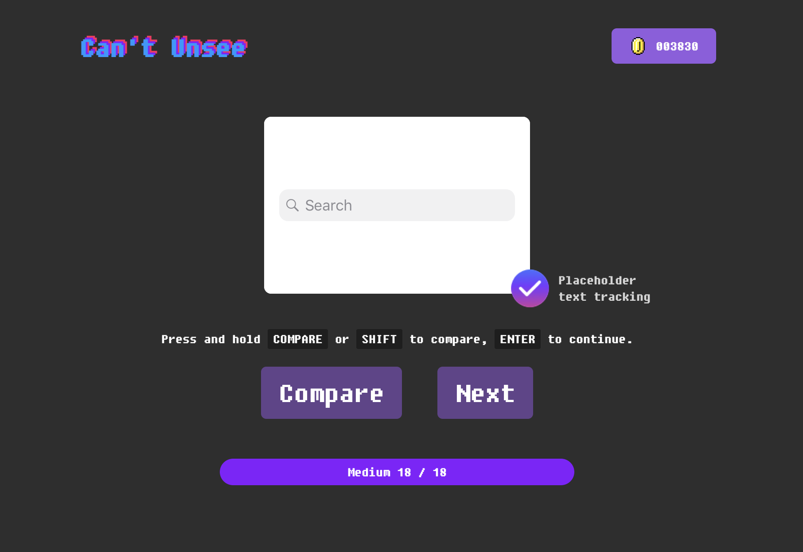
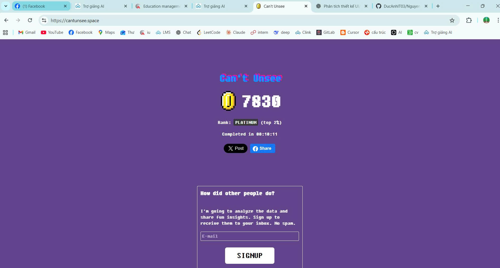

# Kiểm Thử Phần Mềm - SOFT4003

## Giới thiệu

Dự án này chứa tài liệu, mã nguồn và các bài tập liên quan đến môn học **Kiểm thử phần mềm** (SOFT4003).

---

## Bài 1: Nguyên lí của kiểm thử

- **Đường dẫn tới bài tập:** [Can't Unsee](https://cantunsee.space/)
- **Số lần làm:** 03  
- **Ngày thực hiện:** 5/1/2026  

### Kết quả

| Quá trình làm bài | Kết quả cuối cùng |
|:-----------------:|:-----------------:|
|  |  |

> **Kết quả:** Đạt hạng **PLATINUM** với điểm số **7830** 🏆

---

## Bài 2: Quy trình kiểm thử

### Mô tả bài toán

#### StudentAnalyzer

Chương trình phân tích điểm số sinh viên với các chức năng:

- **countExcellentStudents:** Đếm số sinh viên xuất sắc (điểm >= 8.0)
  - Chỉ tính các điểm hợp lệ trong [0, 10]
  - Bỏ qua giá trị null hoặc ngoài phạm vi

- **calculateValidAverage:** Tính trung bình các điểm hợp lệ
  - Chỉ tính điểm thuộc [0, 10]
  - Bỏ qua null hoặc ngoài phạm vi
  - Trả về 0 nếu không có điểm hợp lệ

### Công nghệ sử dụng

| Công nghệ | Mô tả                   |
|-----------|-------------------------|
| Java      | Ngôn ngữ lập trình chính|
| Maven     | Quản lý dự án/phụ thuộc |
| JUnit 5   | Thư viện kiểm thử đơn vị|

### Hướng dẫn sử dụng

#### Yêu cầu hệ thống

- Java Development Kit (JDK) 8+
- Maven 3.6+

#### Bước chuẩn bị

1. **Cài đặt Java JDK:**
    - Tải từ trang [Oracle](https://www.oracle.com/java/technologies/downloads/) hoặc **OpenJDK**
    - Thiết lập biến môi trường `JAVA_HOME`

2. **Cài đặt Maven:**
    - **Cách 1:** (Thủ công):  
      - [Tải Maven](https://maven.apache.org/)  
      - Giải nén & thêm vào biến `MAVEN_HOME`  
      - Thêm vào `PATH`
    - **Cách 2:** (Chocolatey - Windows, khuyến nghị):
      - Mở CMD với quyền admin  
      - Nếu chưa có Chocolatey:
        ```sh
        winget install -e --id Chocolatey.Chocolatey
        ```
      - Cài Maven:
        ```sh
        choco install maven
        ```
3. **Kiểm tra cài đặt:**
    ```sh
    java -version
    mvn -version
    ```

#### Tải dự án

```sh
git clone <đường-dẫn-repo>
cd unit-test
```

#### Biên dịch dự án

```sh
mvn clean compile
```

#### Chạy tất cả kiểm thử

```sh
mvn test
```

#### Chạy kiểm thử cụ thể

```sh
mvn test -Dtest=StudentAnalyzerTest #testCountExcellentStudents_normalCase
```

#### Xem kết quả kiểm thử

Kết quả lưu tại: `unit-test/target/surefire-reports/`

- **XML:** TEST-StudentAnalyzerTest.xml
- **Text:** StudentAnalyzerTest.txt

### Mã nguồn

- **Source code:** [StudentAnalyzer.js](unit-test/src/StudentAnalyzer.js)
- **Test file:** [StudentAnalyzer.test.js](unit-test/test/StudentAnalyzer.test.js)
- **Jest config:** [jest.config.js](unit-test/jest.config.js)

### Chi tiết các ca kiểm thử

| Tên kiểm thử                             | Mô tả                                  |
|------------------------------------------|----------------------------------------|
| testCountExcellentStudents_normalCase    | Đếm SV xuất sắc với dữ liệu hỗn hợp    |
| testCountExcellentStudents_allValid      | Đếm khi tất cả điểm đều hợp lệ         |
| testCountExcellentStudents_emptyList     | Đếm với danh sách rỗng                 |
| testCalculateValidAverage_mixedValues    | Trung bình với giá trị hỗn hợp         |
| testCalculateValidAverage_boundaryValues | Trung bình với giá trị biên            |
| testCalculateValidAverage_emptyList      | Trung bình với danh sách rỗng          |

---

## Bài 3: Kiểm thử tĩnh

### Yêu cầu
- Kiểm thử tự động End-to-End với **Cypress**

### Cài đặt Cypress

#### Yêu cầu

- Node.js 14+

#### Các bước cài đặt

```sh
mkdir cypress-exercise
cd cypress-exercise
npm init -y
npm install cypress --save-dev
```

### Video Demo các bài kiểm thử

Dưới đây là các video demo kết quả chạy Cypress E2E tests:

| Test Suite | Video Demo | Mô tả |
|------------|------------|-------|
| Login Tests | [🎬 login_spec.cy.js.mp4](assets/videos/login_spec.cy.js.mp4) | Kiểm thử đăng nhập thành công và thất bại |
| Cart Tests | [🎬 cart_spec.cy.js.mp4](assets/videos/cart_spec.cy.js.mp4) | Kiểm thử thêm/xóa sản phẩm giỏ hàng |
| Checkout Tests | [🎬 checkout_spec.cy.js.mp4](assets/videos/checkout_spec.cy.js.mp4) | Kiểm thử quy trình thanh toán |

> 📁 **Lưu ý:** Các video được tự động ghi lại bởi Cypress trong quá trình chạy test.

### Mã nguồn Cypress Tests

- **Login tests:** [login_spec.cy.js](Cypress/cypress/e2e/login_spec.cy.js)
- **Cart tests:** [cart_spec.cy.js](Cypress/cypress/e2e/cart_spec.cy.js)  
- **Checkout tests:** [checkout_spec.cy.js](Cypress/cypress/e2e/checkout_spec.cy.js)
- **Cypress config:** [cypress.config.js](Cypress/cypress.config.js)

---

### Kịch bản kiểm thử

1. **Đăng nhập thành công**
   - Truy cập https://www.saucedemo.com  
   - Nhập username: `standard_user`, password: `secret_sauce`
   - Click "Login"  
   - Xác minh URL chứa `/inventory.html`  
   - (**Kịch bản 1**)

2. **Đăng nhập thất bại**
   - Nhập username: `invalid_user`, password: `wrong_password`
   - Click "Login"
   - Xác minh lỗi: _Username and password do not match_
   - (**Kịch bản 2**)

3. **Thêm sản phẩm vào giỏ hàng**
   - Đăng nhập
   - Click "Add to cart" cho sản phẩm đầu tiên
   - Xác minh giỏ hàng badge là 1
   - (**Kịch bản 3**)

4. **Lọc sản phẩm theo giá**
   - Đăng nhập hợp lệ  
   - Chọn bộ lọc "Price (low to high)"
   - Xác minh sản phẩm đầu giá thấp nhất
   - (**Kịch bản 4**)

5. **Xóa sản phẩm khỏi giỏ**
   - Đăng nhập  
   - Thêm sản phẩm đầu tiên vào giỏ  
   - Xác minh badge: 1  
   - Click "Remove"
   - Xác minh badge biến mất  
   - (_Demo xóa sản phẩm_)

6. **Quy trình thanh toán hoàn chỉnh**
   - Đăng nhập  
   - Thêm sản phẩm  
   - Click icon giỏ, "Checkout"  
   - Nhập: First Name: John, Last Name: Doe, Zip: 12345  
   - "Continue"
   - Xác minh `/checkout-step-two.html`
   - (_Demo xóa sản phẩm_)

---

## Đóng góp

- Liên hệ: [phamthangph13](https://github.com/phamthangph13)
- Đóng góp ý kiến/thắc mắc qua Issues hoặc Pull Requests.

---

## License

This project is for educational purposes. If you reuse code, please cite the original author.
